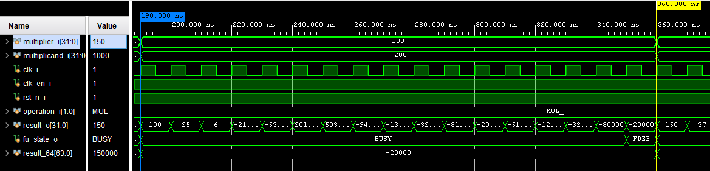

# MULTIPLY UNIT

The multiply unit is responsable for all the four multiply instructions in the "M" RISC-V extension.

## **CUSTOM MODULE**

The custom module is designed for low resources usage and low area, obviusly because of the tradeoffs it is also relatively slow. It's not
pipelined, thus it can accept new values only when the unit is `FREE`. It has 16 latency cycles, and it perform both signed and unsigned 
multiplication. It implement in hardware the **Booth radix-4 multiplication algorithm**, because of this choice and the fact that is
not pipelined, this unit as said earlier does not consume much resources.

---

### **Example:**

Cycle time: 10ns.

We start at T = 190ns, performing (100 * -200) and taking the lower 32 bits of the multiplication (`MUL` operation). As said the unit has 16 latency cycles so basically it will produce the result at T = 190ns + (16ns * 10ns) -> 350ns. 

At T = 350ns the unit will be `FREE` and **in the same clock cycle it can receive new values**.

---

The Vivado Synthesis Tool estimate an usage of:

| **Used:**                       | LUT  | LUTRAM |  FF  | BRAM | URAM | DSP |
| :--------------------------     | :-:  | :----: | :--: | :--: | :-:  | :-: |
| Multiplier module               | 154  |   0    |  101 |  0   |  0   |  0  |

 

## **IP MODULE**

It implement three Xilinx's IP modules:

  * A **signed multiplier**
  * An **unsigned multiplier**
  * A **signed - unsigned multiplier**
  
These modules are fully pipelined and have 4 latency cycles. Because of this the multiply unit can accept one 
instruction per cycle without having to stall the CPU's pipeline. The two modules work in parallel, in the fourth 
cycle we have the output available.

---

### **Example:**

Cycle time: 10ns.

Starting in T = 0ns, we perform 9 * 10 multiplication (MUL). At T = 40ns we'll have the output (90) available.
If in T = 10ns we inserted other inputs, at T = 50ns we'll have the result of that multiplication.

---

The signal that select the output from the modules is inserted in a shift register to align the signal to the pipeline of the modules. By doing so we'll select the right output at the right time.

The Vivado Synthesis Tool estimate an usage of:

| **Used:**                       | LUT  | LUTRAM |  FF  | BRAM | URAM | DSP |
| :--------------------------     | :-:  | :----: | :--: | :--: | :-:  | :-: |
| Multipliers modules             |  27  |   27   |  147 |  0   |  0   |  12 |
| Top module (without multipliers)|  34  |   2    |  4   |  0   |  0   |  0  |
| TOTAL                           |  61  |   29   |  151 |  0   |  0   |  12 |

To calculate the usage for each of multipliers modules just divide by three the numbers.
