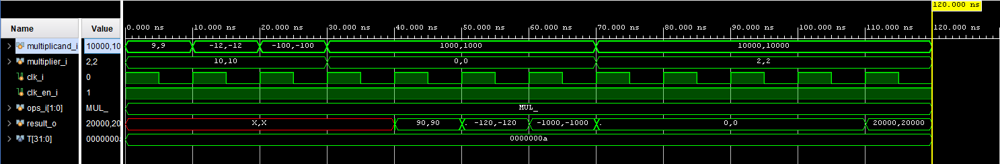

# MULTIPLY UNIT 

## **IP MODULE**

The multiply unit is responsable for all the four multiply instructions in the "M" RISC-V extension.

It implement three Xilinx's IP modules:

  * A **signed multiplier**
  * An **unsigned multiplier**
  * A **signed - unsigned multiplier**
  
These modules are fully pipelined and have 4 latency cycles. Because of this the multiply unit can accept one 
instruction per cycle without having to stall the CPU's pipeline. The two modules work in parallel, in the fourth 
cycle we have the output available.

---

### Example:

Cycle time: 10ns.

Starting in T = 0ns, we perform 9 * 10 multiplication (MUL). At T = 40ns we'll have the output (90) available.
If in T = 10ns we inserted other inputs, at T = 50ns we'll have the result of that multiplication.

---

The signal that select the output from the modules is inserted in a shift register to align the signal to the pipeline of the modules. By doing so we'll select the right output at the right time.

The Vivado Synthesis Tool estimate an usage of:

| **Used:**                       | LUT  | LUTRAM |  FF  | BRAM | URAM | DSP |
| :--------------------------     | :-:  | :----: | :--: | :--: | :-:  | :-: |
| Multipliers modules             |  27  |   27   |  147 |  0   |  0   |  12 |
| Top module (without multipliers)|  34  |   2    |  4   |  0   |  0   |  0  |
| TOTAL                           |  61  |   29   |  151 |  0   |  0   |  12 |
